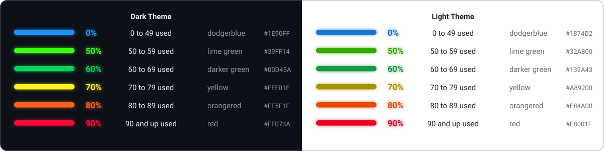

<h1 align="center">
  <picture>
    <source media="(prefers-color-scheme: dark)" srcset="design/readme/title-dark.svg">
    
  </picture>
</h1>

NeonMeter is a Claude Code plugin. It puts your 5-hour window, your weekly window (and each per-model weekly limit your plan has), an optional spend limit and the session's context fill in a single row right above where you type, so you never have to run `/usage` or guess how far a conversation has drifted. The row runs edge to edge, every bar is colored by how full it is, and the live parts pulse. It follows your Claude Code theme and works in the terminal and in the desktop app's Code tab.

<p align="center">
  
</p>

<h2 align="center">Why you want it</h2>

- **Always in view**

The row sits above the prompt, not behind a command. You see the 5-hour window run up before a long task, and the reset time right next to it.

- **Reads at a glance**

Six neon ranges, from calm dodgerblue under 50% to red at 90% and up. The color tells the story before the number does.

- **Glows on the desktop**

In the desktop app every filled bar, dot and percent sits on a soft halo of its own color that breathes on an 800 ms cycle; turn `glow` off for a crisp row. In the terminal the same row is drawn in character cells with a color pulse.

- **Knows your plan**

When your account has a weekly limit for one model, the Weekly segment takes turns between the all-models week and that model, each with its own percent, color and reset. New per-model limits join by themselves.

- **Honest when it cannot know**

If the usage fetch fails or the reading is old, the window segments freeze, fade and show the reading's age. The context segment comes from the session itself and is never stale.

- **Light on your account**

Every open session shares one fetch schedule through the plugin store, so ten chats do not mean ten polls. It backs off on 429 and never sees, stores or logs your credential.

- **Yours to tune**

Fourteen options cover the colors, the range bounds, the glyph, the segments and their order, the pulse, the polling and the theme. The defaults are the approved design.

<h2 align="center">The color scheme</h2>

<p align="center">
  
</p>

Filled cells and percents take the color of the range the percent falls in. A range includes its lower bound, so 50 is lime green and anything from 90 up is red. Under the default `ramp` coloring the filled part runs through every range from the first up to the percent's, in equal stretches, so an 85% bar runs blue, lime, darker green, yellow, orangered and a 69% bar runs blue, lime, darker green; with `barColoring` set to `level` the whole bar takes the percent's color. The light palette is the same six hues darkened for a white ground.

<h2 align="center">Install</h2>

Requirements:

1. Claude Code 2.1.271 or newer (1.0.0 is tested on 2.1.286)
2. A terminal with truecolor or the desktop app's Code tab
3. A Claude subscription for the rate-limit windows (with an API key the windows are hidden and the context takes the whole row)

The repository is its own plugin marketplace, so two commands install it and keep it updatable:

```bash
claude plugin marketplace add IvanPavlak/NeonMeter
```

```bash
claude plugin install neonmeter@neonmeter
```

Start a session and the band appears above the prompt, with the last reading at once and the first fetch a moment later; the desktop app loads the same installed plugin.

Update later with `claude plugin update neonmeter@neonmeter`, or turn on auto-update for the marketplace in `/plugin`.

To run it from a clone instead, for hacking on it or pinning a commit:

```bash
git clone https://github.com/IvanPavlak/NeonMeter.git
```

Then load it for one session with `claude --plugin-dir /path/to/NeonMeter`, or for every session by adding the path to the `env` block of `~/.claude/settings.json` (several plugin paths are separated by the platform's path-list separator, `;` on Windows and `:` elsewhere):

```json
{
	"env": {
		"CLAUDE_CODE_PLUGIN_DIRS": "/path/to/NeonMeter"
	}
}
```

The repository root is the plugin folder: the manifests are in `.claude-plugin/` and the hooks module in `hooks/`.

<h2 align="center">Using it</h2>

Left to right the row shows:

- **5-hour**
- **Weekly**
- **Spend**
    - only when your account reports a spend limit
- **Context**

Each window segment is its label, a bar, the percent used and the time until the window resets; the context segment shows the percent and the tokens used against the model's window. The band is the strip Claude Code gives the plugin above the prompt; the row is the single line of cells or drawings it holds.

**In the desktop app** the band keeps the full labels and the bars stretch to fill whatever room the text leaves. Bars are smooth with rounded ends by default, or a row of dots with `desktopBars` set to `dots`. Everything filled glows.

**In the terminal** the row is built from character cells and picks the most detailed layout that fits the width, from full labels and wide bars down to a text-only line:

<p align="center">
  
</p>

The terminal band opens with a rule in the input box's border color, the same line the input box has at its top. The `[-]` at its right end is Claude Code's own button for collapsing the band; `ctrl+x ctrl+a` does the same.

What the states mean:

- **Pulse**

Live cells and percents brighten toward white and back on an 800 ms cycle, all in phase; on the desktop the halo widens with them. Labels, separators and empty cells stay still.

- **Stale**

The usage fetch failed or the last reading is older than twice the poll interval: the window segments freeze and fade and the row shows the reading's age. Narrow terminal layouts put a `~` before each window percent instead.

- **First load**

Until the first reading lands, the window bars are grey loading cells and the percent is `…`, pulsing.

- **No subscription**

Signed in with an API key or without a first-party credential, the window segments are hidden and the context takes the whole row.

- **Before the first response**

The context bar is empty and shows `--` until the model has answered once.

<h2 align="center">Configuration</h2>

Installed from the marketplace, the options are interactive: open `/plugin`, pick NeonMeter under Installed and choose Configure options, or set them at install time with `--config key=value`. Loaded from a clone, they go in `~/.claude/settings.json` under `pluginConfigs.neonmeter.options`, as below. Either way every option you leave out keeps its default and a new session picks up a change. An out-of-range number is clamped to its range; any other invalid value keeps its default and is named in the debug log (`claude --debug`) when the session starts.

```json
{
	"pluginConfigs": {
		"neonmeter": {
			"options": {
				"desktopBars": "dots",
				"segments": ["context", "five_hour", "seven_day"],
				"ranges": "40,60,75,85,95",
				"pulse": false
			}
		}
	}
}
```

| Option          | Type                                                 | Default                    | What it does                                                                                                                                                                                                                         |
| --------------- | ---------------------------------------------------- | -------------------------- | ------------------------------------------------------------------------------------------------------------------------------------------------------------------------------------------------------------------------------------ |
| `desktopBars`   | `bars` or `dots`                                     | `bars`                     | How bars draw in the desktop app: a smooth glowing bar with rounded ends, or a row of glowing dots. The terminal draws character cells (see `glyph`).                                                                                |
| `barColoring`   | `ramp` or `level`                                    | `ramp`                     | `ramp` runs the filled part through every range up to the percent's, in equal stretches; `level` colors every filled cell by the segment's percent.                                                                                  |
| `segments`      | list of `five_hour`, `seven_day`, `spend`, `context` | all four, in that order    | Which segments to draw and in what order. `spend` shows only when the account reports a spend limit. Unknown and repeated names are ignored.                                                                                         |
| `glow`          | boolean                                              | `true`                     | Draw the desktop's halo under filled bars, dots and percents. Off draws them crisp; the pulse still brightens them. The terminal has no glow either way.                                                                             |
| `pulse`         | boolean                                              | `true`                     | Pulse the live cells and percents. Off draws them still.                                                                                                                                                                             |
| `pulseMs`       | number, 400 to 3000                                  | `800`                      | Length of one pulse cycle in milliseconds.                                                                                                                                                                                           |
| `pollSeconds`   | number, 10 to 3600                                   | `60`                       | Seconds between usage fetches. A reading older than twice this is marked stale.                                                                                                                                                      |
| `rotateSeconds` | number, 2 to 60                                      | `5`                        | How long each weekly limit shows when the Weekly segment rotates between several.                                                                                                                                                    |
| `theme`         | `auto`, `dark` or `light`                            | `auto`                     | The terminal palette. `auto` follows Claude Code's theme setting and falls back to dark when it cannot be read.                                                                                                                      |
| `desktopTheme`  | `auto`, `dark` or `light`                            | `auto`                     | The desktop palette. `auto` follows the app's own light or dark appearance, including a system theme it follows, and checks again every minute.                                                                                      |
| `ranges`        | text: five whole numbers from 1 to 99, ascending     | `"50,60,70,80,90"`         | Where ranges 2 to 6 start. The first range runs from 0 to the first number; a range includes its lower bound.                                                                                                                        |
| `colorsDark`    | list of six `#RRGGBB` colors                         | the six neon colors        | The range colors on a dark background, lowest range first. Stale shades and the pulse are derived from them.                                                                                                                         |
| `colorsLight`   | list of six `#RRGGBB` colors                         | the six light-theme colors | The range colors on a light background, lowest range first.                                                                                                                                                                          |
| `glyph`         | one single-width character                           | `━`                        | The character every terminal bar cell is drawn with, filled and empty alike: `━` runs into a continuous bar; `●`, `■`, `█` or `•` make dotted ones. Wide characters and emoji are refused. The desktop draws vectors and ignores it. |

<h2 align="center">How usage is fetched, and what the plugin touches</h2>

The rate-limit windows come from the same first-party usage endpoint the built-in `/usage` command reads. NeonMeter asks Claude Code for an opaque credential handle and passes it to the engine's own HTTP call; the engine attaches your account credential to the request itself. The plugin never sees, stores or logs the credential. It also takes the windows the engine reports after each response, and fetches only when the newest reading is older than `pollSeconds`.

The endpoint limits how often an account may ask, so every open session shares one schedule through the plugin store: one session fetches per period and the others show what it fetched. When the endpoint answers 429, every session waits twice as long as before, up to 30 minutes, until a fetch succeeds again. The last reading is cached in the plugin's store, so a new session shows it at once, live while it is younger than twice `pollSeconds` and marked stale with its age after that, until the first fetch lands.

To follow the desktop app's appearance under `desktopTheme: auto`, the plugin reads the app's own theme setting from its config file and, when the app follows the system, asks the operating system once a minute: `reg query` on Windows, `defaults read` on macOS, `gsettings get` on GNOME. Besides that it reads Claude Code's own theme setting and the `APPDATA`, `HOME`, `USERPROFILE` and `XDG_CONFIG_HOME` variables to find that file. Nothing else is read or run, and nothing is sent anywhere but the usage endpoint.

<h2 align="center">Known limitations</h2>

- **One band per desktop window.** With several chats side by side in one window of the desktop app, only one of them shows the band. The app draws the band above the prompt for one chat per window whatever a plugin draws. The terminal has no such limit. Reported upstream as [anthropics/claude-code#99265](https://github.com/anthropics/claude-code/issues/99265).
- **No glow in the terminal.** A terminal paints each cell with one foreground and one background color, so the halo is the desktop's alone. The terminal keeps the pulse.

<h2 align="center">Development</h2>

```bash
claude plugin validate .claude-plugin/plugin.json --strict
claude plugin validate .claude-plugin/marketplace.json --strict
claude plugin test .
```

`validate` on the plugin manifest reads it and the hooks module the way the engine will and reports what the module hooks and calls; on the marketplace manifest it checks the catalog. (With both manifests present, `validate .` checks only the marketplace.) `test` runs the files in `tests/` against the engine itself, on the terminal and desktop surfaces, including a character-for-character comparison with the fifty golden rows of the design specification. CI installs the Claude Code release pinned in `.github/workflows/ci.yml` and runs all three; bump the pin together with the version requirement above.

For hot reload while editing, start a session with `claude --plugin-dir .` from the repository root; saving a file reloads the module. In such a session `/plugin-types` writes the engine's declarations to `.claude-plugin/types/` (ignored by git); `npx tsc -p .claude-plugin/types/tsconfig.json` then type-checks the hooks and tests against them.

The design canvas under [`design/`](design/README.md) is the source of truth for the look, with an interactive playground and every state on both themes; open `design/index.html` in a browser. It matches the shipped defaults: `━` cells in the terminal, smooth glowing bars on the desktop, and ramp coloring across the fill. The graphics on this page, the title and the terminal rows included, are generated by `design/readme/make.py` from the same palette and geometry; the terminal rows come from the builder itself, dumped to `design/readme/terminal-rows.json`.