<h1 align="center">
  <picture>
    <source media="(prefers-color-scheme: dark)" srcset="design/readme/title-dark.svg">
    
  </picture>
</h1>

NeonMeter is a Claude Code plugin. It puts your 5-hour window, your weekly window (and each per-model weekly limit your plan has), an optional spend limit and the session's context fill in a single row right above where you type, so you never have to run `/usage` or guess how far a conversation has drifted. The row runs edge to edge, every bar is colored by how full it is, and the band pulses when a value changes. It follows your Claude Code theme and works in the terminal and in the desktop app's Code tab.

<p align="center">
  
</p>

<h2 align="center" id="contents">Contents</h2>

- [Why you want it](#why-you-want-it)
- [Install](#install)
- [Configuration](#configuration)
- [Using it](#using-it)
- [The color scheme](#the-color-scheme)
- [Every option at a glance](#every-option)
- [How usage is fetched, and what the plugin touches](#how-usage-is-fetched)
- [Known limitations](#known-limitations)
- [Development](#development)
- [Resource use](#resource-use)

<h2 align="center" id="why-you-want-it">Why you want it</h2>

- **Always in view**

The row sits above the prompt, not behind a command. You see the 5-hour window run up before a long task, and the reset time right next to it.

- **Reads at a glance**

Six neon ranges, from calm dodgerblue under 50% to red at 90% and up. The color tells the story before the number does.

- **Glows on the desktop**

In the desktop app every filled bar, dot and percent sits on a soft halo of its own color that breathes on an 800 ms cycle; turn `glow` off for a crisp row. In the terminal the same row is drawn in character cells with a color pulse.

- **Breathes when something changes**

By default the band breathes three times whenever a value changes, a percent, the context or the reading going stale, and holds its glow still in between, so it shows you what just moved and costs next to nothing while it waits. Set `pulseMode` to `always` for a breath that never stops, at about a third of a CPU core in the desktop app (see [Resource use](#resource-use)).

- **Knows your plan**

When your account has a weekly limit for one model, the Weekly segment takes turns between the all-models week and that model, each with its own percent, color and reset. New per-model limits join by themselves.

- **Honest when it cannot know**

If the usage fetch fails or the reading is old, the window segments freeze, fade and show the reading's age. A per-model weekly limit comes only from the fetch, so when that has not landed for twice `pollSeconds` while Claude Code keeps the other windows fresh after each reply, that segment alone fades. The context segment comes from the session itself and is never stale.

- **Light on your account**

Every open session shares one fetch schedule through the plugin store, so ten chats do not mean ten polls. It backs off on 429 and never sees, stores or logs your credential.

- **Yours to tune**

Twenty-one options cover the colors, the range bounds, the glyph, the segments and their order, the layout (every segment in one row, or one at a time across the whole row), the pulse and when it runs, how each reset reads and whether it is colored by the time left, the polling and the theme. The defaults are the approved design.

<h2 align="center" id="install">Install</h2>

Requirements:

1. Claude Code 2.1.286 or newer, in the terminal and in the desktop app. From 2.1.287 on, plugin mods (the hooks modules NeonMeter is built on) are on by default; on 2.1.286 they need one setting, below. The desktop app keeps its own copy of Claude Code and updates it by itself when it starts.
2. A terminal with truecolor or the desktop app's Code tab
3. A Claude subscription for the rate-limit windows (with an API key the windows are hidden and the context takes the whole row)

Inside a Claude Code session, one command adds this repository as a plugin marketplace and installs NeonMeter. Claude Code shows the marketplace's source and asks before adding it, then opens the plugin so you can choose where to install it:

```text
/plugin install neonmeter --marketplace IvanPavlak/NeonMeter
```

From a shell, the same takes two commands:

```bash
claude plugin marketplace add IvanPavlak/NeonMeter
```

```bash
claude plugin install neonmeter@neonmeter
```

The desktop app's Code tab has no `/plugin`. Once the marketplace is added, from a terminal with the first command above, NeonMeter is listed under **+** › **Plugins** › **Add plugin**, and **Manage plugins** turns it on, off or uninstalls it. The terminal and the desktop app read the same settings, so a plugin installed in one is installed in the other.

Run `/reload-plugins` in an open session, or start a new one, and the band appears above the prompt, with the last reading at once and the first fetch a moment later. The module loads only in a folder you have trusted.

**On Claude Code 2.1.286**, the version the desktop app bundles at the time of writing (see its About window), mods stay off until one variable is set. A plugin cannot set it itself, because none of its code runs until the variable is on. Add it to `~/.claude/settings.json`; the `env` block reaches every session, the desktop app's included. Claude Code 2.1.287 and later ignore it, so it can go once your copies are that new:

```json
{
	"env": {
		"CLAUDE_CODE_ENABLE_FUNCTION_HOOKS": "1"
	}
}
```

Update later with `claude plugin update neonmeter@neonmeter`, or turn on auto-update for the marketplace in `/plugin`.

**To uninstall**, remove the marketplace. That uninstalls the plugin, deletes Claude Code's copy of the repository and drops both from your settings:

```bash
claude plugin marketplace remove neonmeter
```

`claude plugin uninstall neonmeter@neonmeter` removes only the plugin and keeps the marketplace. Either way Claude Code keeps the plugin's cached copy in `~/.claude/plugins/cache/neonmeter` and deletes it 14 days later; delete that folder to remove it now. If you added the variable above for NeonMeter alone, take it out of `settings.json` too.

**Optional scripts.** The repository also has an installer and an uninstaller for each shell, for when you would rather run one command. Read them before you run them; they call the same `claude plugin` commands and touch nothing but NeonMeter. The installer stops with the update command when `claude` is older than 2.1.286, repairs an install whose files are missing (an older `claude` records an install it never copied), sets the variable above, keeping the previous `settings.json` as `settings.json.neonmeter.bak`, and checks the result. The uninstaller removes the plugin, its marketplace, the folders Claude Code can leave behind and NeonMeter's settings; it keeps a marketplace named `neonmeter` that comes from somewhere else, every other plugin and setting, and the variable when another plugin may use it.

```bash
curl -fsSL https://raw.githubusercontent.com/IvanPavlak/NeonMeter/master/install.sh | bash
```

```bash
curl -fsSL https://raw.githubusercontent.com/IvanPavlak/NeonMeter/master/uninstall.sh | bash
```

On Windows, in PowerShell:

```powershell
irm https://raw.githubusercontent.com/IvanPavlak/NeonMeter/master/install.ps1 | iex
```

```powershell
irm https://raw.githubusercontent.com/IvanPavlak/NeonMeter/master/uninstall.ps1 | iex
```

**If the band does not appear**, start a session with `claude --debug` and look for `hooks module neonmeter@neonmeter not loaded`: the line says why, the switch being off included. A debug log that says `Unrecognized key(s) in object: 'types', 'userConfig'` comes from a `claude` older than 2.1.286; update it (`npm install -g @anthropic-ai/claude-code@latest` for an npm install, `claude update` otherwise) and install again. A desktop app that shows nothing and logs nothing is on 2.1.286 without the variable, or has lost the plugin's cached copy, which `claude plugin uninstall neonmeter@neonmeter` and `claude plugin install neonmeter@neonmeter` restore.

To run it from a clone instead, for hacking on it or pinning a commit:

```bash
git clone https://github.com/IvanPavlak/NeonMeter.git
```

Then load it for one session with `claude --plugin-dir /path/to/NeonMeter`, or for every session by adding the path to the `env` block of `~/.claude/settings.json` (several plugin paths are separated by the platform's path-list separator, `;` on Windows and `:` elsewhere):

```json
{
	"env": {
		"CLAUDE_CODE_PLUGIN_DIRS": "/path/to/NeonMeter"
	}
}
```

The repository root is the plugin folder: the manifests are in `.claude-plugin/` and the hooks module in `hooks/`.

<h2 align="center" id="configuration">Configuration</h2>

Twenty-one options, listed in the table below, change the look and the behaviour. Every option you leave out keeps its default. Options are saved in Claude Code's settings, not in the plugin's files, so they survive every update; uninstalling the plugin deletes them.

**To see what each option does**, [Every option at a glance](#every-option), further down, shows each one as a picture.

**From a shell** (works for the terminal and the desktop app alike), pipe a JSON object of the options you want to change into `claude plugin configure`:

```bash
echo '{"barColoring":"ramp","desktopBars":"dots","glyph":"●"}' | claude plugin configure neonmeter@neonmeter --values-stdin
```

How to write the values:

- **Every value is text in quotes**, numbers and true/false included: `"pollSeconds":"30"`, `"pulse":"false"`. Claude Code stores them as numbers and booleans.
- **Lists are comma-separated text:** `"segments":"context,five_hour"`, `"colorsDark":"#112233,#223344,#334455,#445566,#556677,#667788"`.
- **A value outside an option's choices or range is refused** with a message, and nothing is saved.
- **Options you leave out keep their current value.** To reset one, set it to its default from the table.
- **To see what is set:** `claude plugin configure neonmeter@neonmeter`.
- **A change applies** in the next session, or at once after `/reload-plugins` in an open one.
- **In Windows PowerShell 5.1**, run `$OutputEncoding = New-Object Text.UTF8Encoding $false` first when a value has a character beyond ASCII, such as `●`; otherwise it arrives as `?`. PowerShell 7, Git Bash and other shells need nothing.

**Inside a terminal session**, `/plugin` shows the same options as pickers and fields: pick NeonMeter under Installed and choose Configure options. The desktop app's Code tab has no `/plugin`; use the shell command there.

**At install time**, add `--config key=value` once per option: `claude plugin install neonmeter@neonmeter --config layout=single --config barColoring=ramp`.

**Common setups:**

| You want                                              | Pipe this into `claude plugin configure neonmeter@neonmeter --values-stdin`                     |
| ----------------------------------------------------- | ----------------------------------------------------------------------------------------------- |
| Ramp coloring instead of level                        | `{"barColoring":"ramp"}`                                                                        |
| Dots, in the desktop app and in the terminal          | `{"desktopBars":"dots","glyph":"●"}`                                                            |
| One segment at a time across the row                  | `{"layout":"single"}`                                                                           |
| One segment at a time, as ramp dots, 8 s each         | `{"layout":"single","desktopBars":"dots","glyph":"●","barColoring":"ramp","rotateSeconds":"8"}` |
| Only the context and the 5-hour window, in that order | `{"segments":"context,five_hour"}`                                                              |
| A breath that never stops (the pulse before 1.2.0)    | `{"pulseMode":"always"}`                                                                        |
| Five breaths after each change instead of three       | `{"pulseCount":"5"}`                                                                            |
| A still band without the halo                         | `{"pulse":"false","glow":"false"}`                                                              |
| Fewer usage fetches                                   | `{"pollSeconds":"300"}`                                                                         |
| Weekly resets as a day and time, as before 1.3.0      | `{"weeklyReset":"clock"}`                                                                       |
| The 5-hour reset as a clock time                      | `{"fiveHourReset":"clock"}`                                                                     |
| Reset times colored by the time left, pulsing         | `{"resetColor":"time"}`                                                                         |
| Your own ranges and colors                            | `{"ranges":"40,60,75,85,95","colorsDark":"#1E90FF,#39FF14,#00D45A,#FFF01F,#FF5F1F,#FF073A"}`    |

Every option at its default, to copy as a template or to reset everything:

```bash
echo '{"layout":"all","barColoring":"level","desktopBars":"bars","glyph":"━","segments":"five_hour,seven_day,spend,context","pulse":"true","pulseMode":"responsive","pulseCount":"3","pulseMs":"800","glow":"true","pollSeconds":"60","rotateSeconds":"5","fiveHourReset":"countdown","weeklyReset":"countdown","resetColor":"plain","theme":"auto","desktopTheme":"auto","ranges":"50,60,70,80,90","timeRanges":"17,33,50,67,83","colorsDark":"#1E90FF,#39FF14,#00D45A,#FFF01F,#FF5F1F,#FF073A","colorsLight":"#1874D2,#32A800,#139A43,#A89200,#E84A00,#E8001F"}' | claude plugin configure neonmeter@neonmeter --values-stdin
```

**Where they are stored:** `~/.claude/settings.json`, under `pluginConfigs`, keyed by the plugin's id. You can edit them there by hand too; there a list may be written either as comma-separated text or as a JSON list:

```json
{
	"pluginConfigs": {
		"neonmeter@neonmeter": {
			"options": {
				"layout": "single",
				"desktopBars": "dots",
				"segments": ["context", "five_hour", "seven_day"],
				"ranges": "40,60,75,85,95",
				"pulse": false
			}
		}
	}
}
```

Loaded from a clone instead of installed (`--plugin-dir`, see Install), the key is `neonmeter` instead of `neonmeter@neonmeter`. A value set by hand is not checked when you save the file: an out-of-range number is clamped to its range, and any other invalid value keeps its default and is named in the debug log (`claude --debug`) when the session starts.

| Option          | Type                                                 | Default                    | What it does                                                                                                                                                                                                                                                                                                                                                                                                                                                           |
| --------------- | ---------------------------------------------------- | -------------------------- | ---------------------------------------------------------------------------------------------------------------------------------------------------------------------------------------------------------------------------------------------------------------------------------------------------------------------------------------------------------------------------------------------------------------------------------------------------------------------- |
| `desktopBars`   | `bars` or `dots`                                     | `bars`                     | How bars draw in the desktop app: a smooth glowing bar with rounded ends, or a row of glowing dots; both follow `barColoring`. The terminal draws character cells (see `glyph`).                                                                                                                                                                                                                                                                                       |
| `barColoring`   | `level` or `ramp`                                    | `level`                    | `level` colors every filled cell by the segment's percent; `ramp` runs the filled part through every range up to the percent's, in equal stretches.                                                                                                                                                                                                                                                                                                                    |
| `segments`      | list of `five_hour`, `seven_day`, `spend`, `context` | all four, in that order    | Which segments to draw and in what order. `spend` shows only when the account reports a spend limit. Unknown and repeated names are ignored.                                                                                                                                                                                                                                                                                                                           |
| `layout`        | `all` or `single`                                    | `all`                      | `all` draws every segment in one row. `single` draws one segment across the whole row and takes turns, `rotateSeconds` each: 5-hour, Weekly and each per-model limit, Spend, Context.                                                                                                                                                                                                                                                                                  |
| `glow`          | boolean                                              | `true`                     | Draw the desktop's halo under filled bars, dots and percents. Off draws them crisp; the pulse still brightens them. The terminal has no glow either way.                                                                                                                                                                                                                                                                                                               |
| `pulse`         | boolean                                              | `true`                     | Pulse the live cells and percents. Off draws them still, whatever `pulseMode` says.                                                                                                                                                                                                                                                                                                                                                                                    |
| `pulseMode`     | `responsive` or `always`                             | `responsive`               | When the pulse runs. `responsive` pulses the whole band `pulseCount` cycles each time a value changes (a percent, the context, the reading going stale or coming back) and holds the glow still otherwise; a session start and a turn of the Weekly rotation are no change. `always` never stops, which costs about a third of a CPU core in the desktop app.                                                                                                          |
| `pulseCount`    | number, 1 to 20                                      | `3`                        | How many cycles the `responsive` pulse runs after each change.                                                                                                                                                                                                                                                                                                                                                                                                         |
| `pulseMs`       | number, 400 to 3000                                  | `800`                      | Length of one pulse cycle in milliseconds.                                                                                                                                                                                                                                                                                                                                                                                                                             |
| `pollSeconds`   | number, 10 to 3600                                   | `60`                       | Seconds between usage fetches. A reading older than twice this is marked stale.                                                                                                                                                                                                                                                                                                                                                                                        |
| `rotateSeconds` | number, 2 to 60                                      | `5`                        | How long each weekly limit shows when the Weekly segment rotates between several, and each segment in the `single` layout.                                                                                                                                                                                                                                                                                                                                             |
| `fiveHourReset` | `countdown` or `clock`                               | `countdown`                | How the 5-hour reset shows on the widest layout: `countdown` is the time left (`in 3h13m`), `clock` the time it resets (`14:05`). Narrower layouts always count down.                                                                                                                                                                                                                                                                                                  |
| `weeklyReset`   | `countdown` or `clock`                               | `countdown`                | How every weekly limit's reset shows on the widest layout, the per-model ones such as Fable included: `countdown` is the time left, as the 5-hour window shows it (`in 2d15h`, then `in 8h50m`), `clock` the day and time (`Thu 14:05`). Narrower layouts always count down.                                                                                                                                                                                                                          |
| `resetColor`    | `plain` or `time`                                    | `plain`                    | `plain` draws each window's reset in the text color. `time` colors it by the share of its window still to run, on the same six colors as the percents, starting where `timeRanges` says: a reset that is close is blue, one far off red, whatever the percent used, so limits that reset together share a color. It pulses with the percents, glows on the desktop and fades when stale; a reset moving to the next color counts as a change for the responsive pulse. |
| `theme`         | `auto`, `dark` or `light`                            | `auto`                     | The terminal palette. `auto` follows Claude Code's theme setting and falls back to dark when it cannot be read.                                                                                                                                                                                                                                                                                                                                                        |
| `desktopTheme`  | `auto`, `dark` or `light`                            | `auto`                     | The desktop palette. `auto` follows the app's own light or dark appearance, including a system theme it follows, and checks again every minute.                                                                                                                                                                                                                                                                                                                        |
| `ranges`        | text: five whole numbers from 1 to 99, ascending     | `"50,60,70,80,90"`         | Where ranges 2 to 6 start. The first range runs from 0 to the first number; a range includes its lower bound.                                                                                                                                                                                                                                                                                                                                                          |
| `timeRanges`    | text: five whole numbers from 1 to 99, ascending     | `"17,33,50,67,83"`         | Where time ranges 2 to 6 start for `resetColor: time`, as the share of the window still to run. The default splits every window into six even steps: about 50 minutes of a 5-hour window and 1.2 days of a week per color. The percents keep `ranges`.                                                                                                                                                                                                                 |
| `colorsDark`    | list of six `#RRGGBB` colors                         | the six neon colors        | The range colors on a dark background, lowest range first. Stale shades and the pulse are derived from them.                                                                                                                                                                                                                                                                                                                                                           |
| `colorsLight`   | list of six `#RRGGBB` colors                         | the six light-theme colors | The range colors on a light background, lowest range first.                                                                                                                                                                                                                                                                                                                                                                                                            |
| `glyph`         | one single-width character                           | `━`                        | The character every terminal bar cell is drawn with, filled and empty alike: `━` runs into a continuous bar; `●`, `■`, `█` or `•` make dotted ones. Wide characters and emoji are refused. The desktop draws vectors and ignores it.                                                                                                                                                                                                                                   |

<h2 align="center" id="using-it">Using it</h2>

Left to right the row shows:

- **5-hour**
- **Weekly**
- **Spend**
    - only when your account reports a spend limit
- **Context**

Each window segment is its label, a bar, the percent used and its reset: every window counts down to it, `in 3h13m` for the 5-hour window and `in 3d4h` for a weekly limit on the widest layout, `3h13m` and `3d4h` on narrower ones. `fiveHourReset` and `weeklyReset` switch either one to the other form, and `resetColor` set to `time` colors the reset by how much of its window is still to run. The context segment shows the percent and the tokens used against the model's window. The band is the strip Claude Code gives the plugin above the prompt; the row is the single line of cells or drawings it holds.

**In the desktop app** the band keeps the full labels and the bars stretch to fill whatever room the text leaves. Bars are smooth with rounded ends by default, or a row of dots with `desktopBars` set to `dots`. Everything filled glows.

**In the terminal** the row is built from character cells and picks the most detailed layout that fits the width, from full labels and wide bars down to a text-only line:

<p align="center">
  
</p>

The terminal band opens with a rule in the input box's border color, the same line the input box has at its top. The `[-]` at its right end is Claude Code's own button for collapsing the band; `ctrl+x ctrl+a` does the same.

**With `layout` set to `single`** the band shows one segment at a time across the whole row and takes turns, `rotateSeconds` each: 5-hour, Weekly, then each per-model weekly limit, the spend limit when your account has one, and Context, in the order of `segments`. Every bar style works the same way: ramp or level coloring, the terminal's cells, and the desktop's smooth bars or dots. Both graphics group their examples by layout: **Layout: All (Default)** first, then **Layout: Single (One Segment at a Time)**, each in four looks: level bars (the default), ramp bars, and dots in either coloring (on the desktop `desktopBars: dots`, in the terminal `glyph` set to `●`). Dots follow `barColoring` like bars do: under `level` every filled dot takes the percent's color, under `ramp` the filled dots run through the ranges. For one glowing dot bar at a time, colored by its percent (the default level coloring):

```json
{
	"pluginConfigs": {
		"neonmeter": {
			"options": {
				"layout": "single",
				"desktopBars": "dots"
			}
		}
	}
}
```

What the states mean:

- **Pulse**

Live cells and percents brighten toward white and back on an 800 ms cycle, all in phase; on the desktop the halo widens with them. Labels, separators and empty cells stay still. By default the pulse runs three cycles each time a value changes and the band holds still in between; a session start and a turn of the Weekly rotation are no change (`pulseMode` and `pulseCount` below).

- **Stale**

The usage fetch failed or the last reading is older than twice the poll interval: the window segments freeze and fade and the row shows the reading's age. Narrow terminal layouts put a `~` before each window percent instead.

- **First load**

Until the first reading lands, the window bars are grey loading cells and the percent is `…`, pulsing under `pulseMode: always`; the reading arriving is a change, so the band pulses then by default.

- **No subscription**

Signed in with an API key or without a first-party credential, the window segments are hidden and the context takes the whole row.

- **Before the first response**

The context bar is empty and shows `--` until the model has answered once.

<h2 align="center" id="the-color-scheme">The color scheme</h2>

<p align="center">
  
</p>

Filled cells and percents take the color of the range the percent falls in. A range includes its lower bound, so 50 is lime green and anything from 90 up is red. Under the default `level` coloring the whole bar takes the percent's color. With `barColoring` set to `ramp` the filled part runs through every range from the first up to the percent's, in equal stretches, so an 85% bar runs blue, lime, darker green, yellow, orangered and a 69% bar runs blue, lime, darker green. The light palette is the same six hues darkened for a white ground.

<h2 align="center" id="every-option">Every option at a glance</h2>

Each option below has a picture of its values, the desktop band above the terminal band, drawn by the plugin's own builder and drawings. The pictures hold still, so the pulse options (`pulse`, `pulseMode`, `pulseCount`, `pulseMs`) and `rotateSeconds` have none; `theme` and `desktopTheme` are the pictures themselves: they follow your GitHub theme.

<h3><code>layout</code>: <code>all</code> or <code>single</code></h3>
<p>Every segment in one row, or one segment across the whole row at a time, taking turns.</p>
<picture>
  <source media="(prefers-color-scheme: dark)" srcset="design/readme/options/layout-dark.svg">
  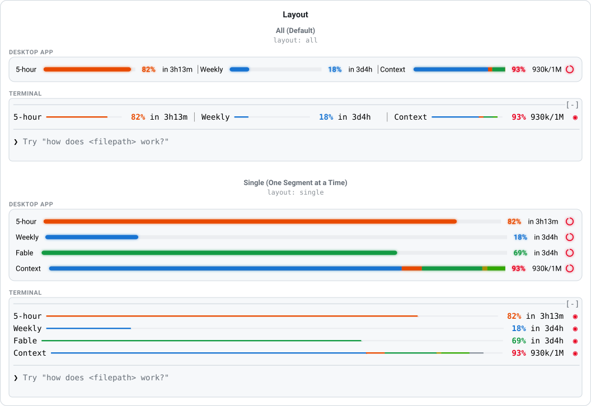
</picture>

<h3><code>barColoring</code>: <code>level</code> or <code>ramp</code></h3>
<p>The whole fill in the percent's color, or the fill running through every range up to it.</p>
<picture>
  <source media="(prefers-color-scheme: dark)" srcset="design/readme/options/barColoring-dark.svg">
  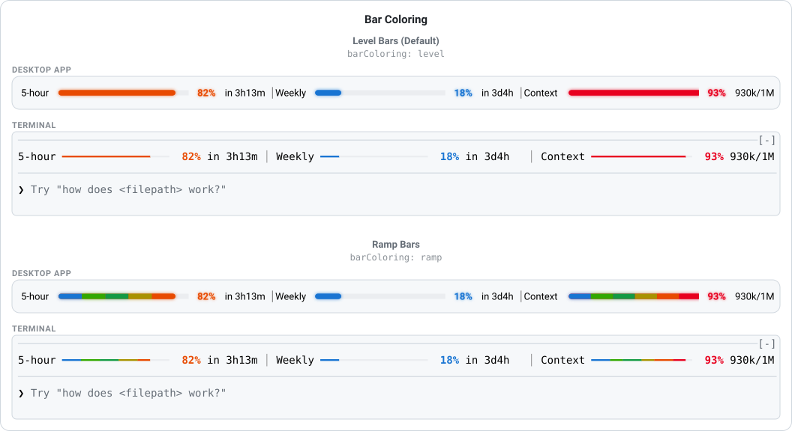
</picture>

<h3><code>desktopBars</code>: <code>bars</code> or <code>dots</code></h3>
<p>Smooth glowing bars or rows of glowing dots, in the desktop app.</p>
<picture>
  <source media="(prefers-color-scheme: dark)" srcset="design/readme/options/desktopBars-dark.svg">
  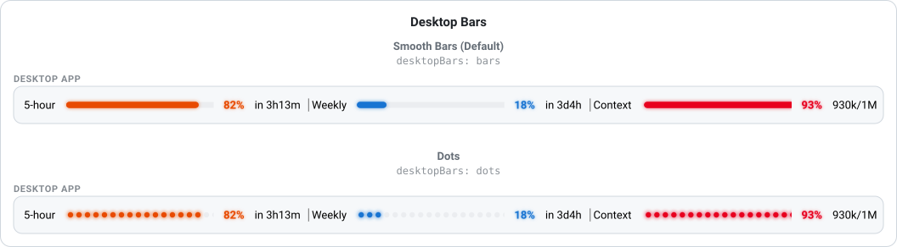
</picture>

<h3><code>glyph</code>: one character</h3>
<p>The terminal's bar cell: <code>━</code> runs into a continuous bar, <code>●</code> or <code>■</code> make dotted ones.</p>
<picture>
  <source media="(prefers-color-scheme: dark)" srcset="design/readme/options/glyph-dark.svg">
  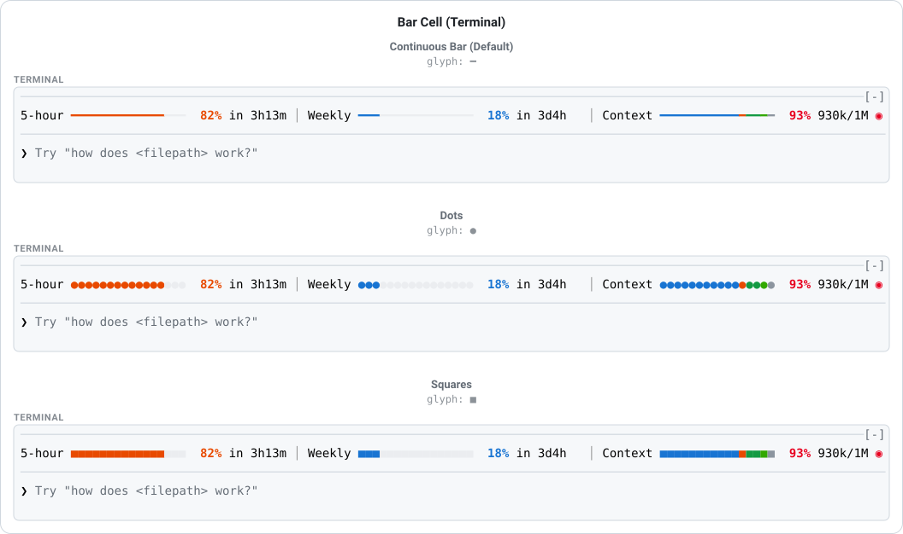
</picture>

<h3><code>glow</code>: <code>true</code> or <code>false</code></h3>
<p>The desktop's halo under bars, dots and percents.</p>
<picture>
  <source media="(prefers-color-scheme: dark)" srcset="design/readme/options/glow-dark.svg">
  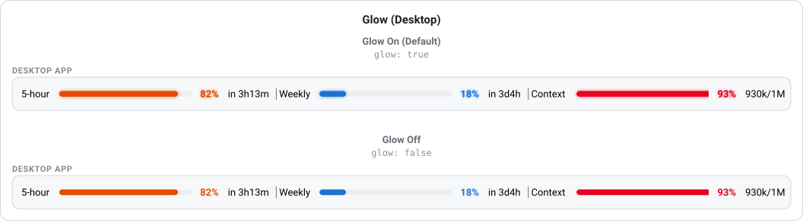
</picture>

<h3><code>segments</code>: a list</h3>
<p>Which segments to draw and in what order.</p>
<picture>
  <source media="(prefers-color-scheme: dark)" srcset="design/readme/options/segments-dark.svg">
  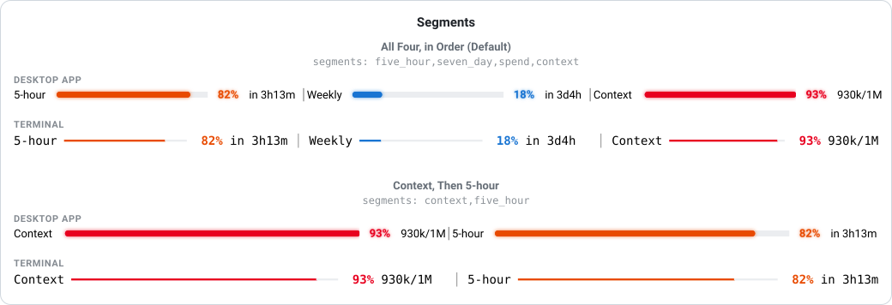
</picture>

<h3><code>ranges</code>: five bounds</h3>
<p>Where each of the six colors starts for the percents.</p>
<picture>
  <source media="(prefers-color-scheme: dark)" srcset="design/readme/options/ranges-dark.svg">
  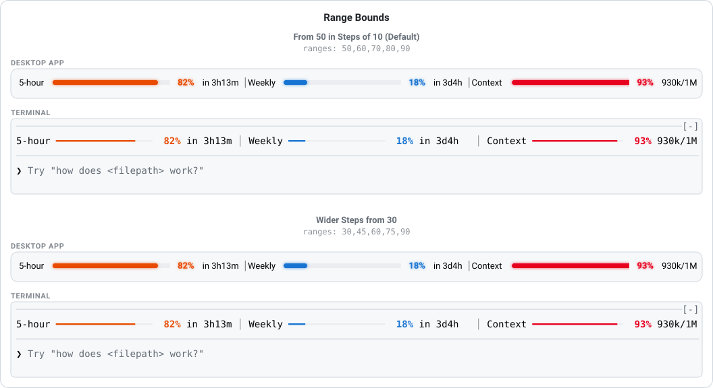
</picture>

<h3><code>fiveHourReset</code>: <code>countdown</code> or <code>clock</code></h3>
<p>The 5-hour reset as the time left or the time it happens, on the widest layout.</p>
<picture>
  <source media="(prefers-color-scheme: dark)" srcset="design/readme/options/fiveHourReset-dark.svg">
  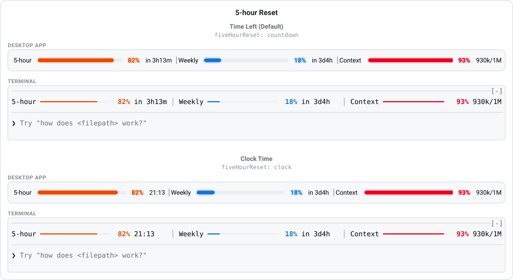
</picture>

<h3><code>weeklyReset</code>: <code>countdown</code> or <code>clock</code></h3>
<p>Every weekly reset as the time left or the day and time, on the widest layout.</p>
<picture>
  <source media="(prefers-color-scheme: dark)" srcset="design/readme/options/weeklyReset-dark.svg">
  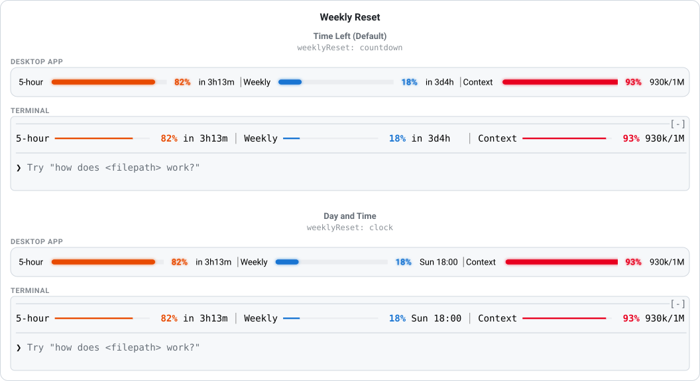
</picture>

<h3><code>resetColor</code>: <code>plain</code> or <code>time</code></h3>
<p>Each reset in the text color, or colored by how much of its window is still to run, with the pulse and the glow.</p>
<picture>
  <source media="(prefers-color-scheme: dark)" srcset="design/readme/options/resetColor-dark.svg">
  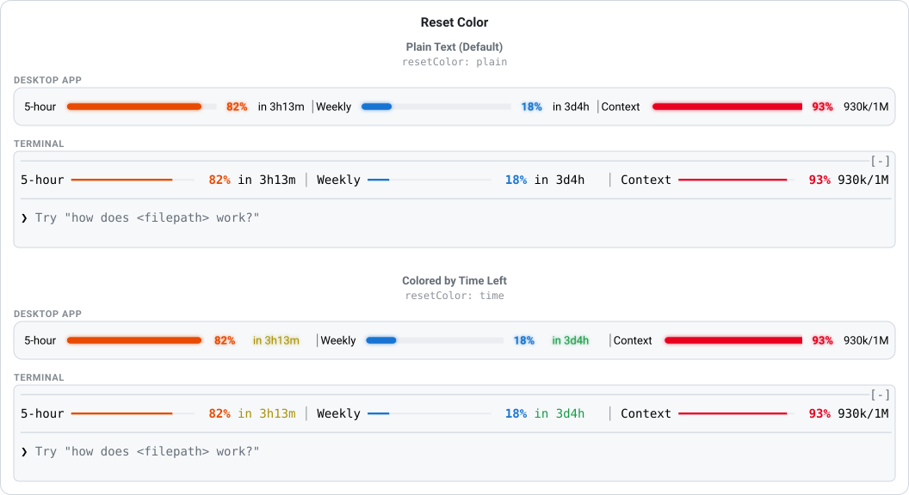
</picture>

<h3><code>timeRanges</code>: five bounds</h3>
<p>Where each time color starts under <code>resetColor: time</code>; the default is six even steps of every window.</p>
<picture>
  <source media="(prefers-color-scheme: dark)" srcset="design/readme/options/timeRanges-dark.svg">
  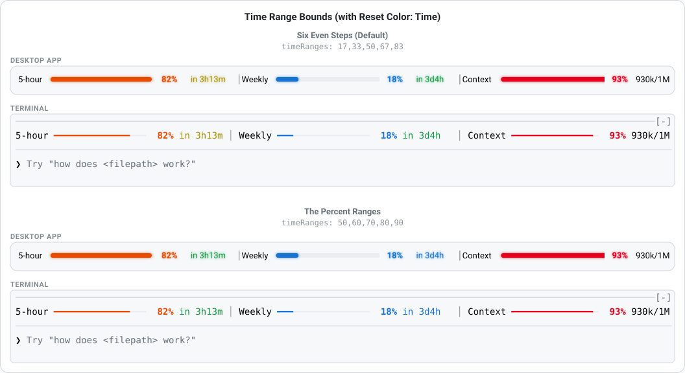
</picture>

<h2 align="center" id="how-usage-is-fetched">How usage is fetched, and what the plugin touches</h2>

The rate-limit windows come from the same first-party usage endpoint the built-in `/usage` command reads. NeonMeter asks Claude Code for an opaque credential handle and passes it to the engine's own HTTP call; the engine attaches your account credential to the request itself. The plugin never sees, stores or logs the credential. It also takes the windows the engine reports after each response, and fetches only when the newest reading is older than `pollSeconds`.

The endpoint limits how often an account may ask, so every open session shares one schedule through the plugin store: one session fetches per period and the others show what it fetched. The fetch runs every period whether or not Claude Code has just reported the 5-hour and all-models windows after a reply, because the per-model weekly limits come only from the endpoint; those windows show the endpoint's newest figure within a period of the reply that moved them, and the endpoint itself can run a little behind the live counters Claude Code's own usage popup reads. When the endpoint answers 429, every session waits twice as long as before, up to 30 minutes, until a fetch succeeds again. The last reading is cached in the plugin's store, so a new session shows it at once, live while it is younger than twice `pollSeconds` and marked stale with its age after that, until the first fetch lands.

The context segment is the size of the last request: the input tokens the model's last response was answered over, cached and uncached together, against the model's context window, as Claude Code measures it. Claude Code sends that measurement after each turn, so the context moves when a reply finishes, while the rate-limit windows also refresh between turns. Claude Code's own context indicator can read a little higher at the same moment, because it counts a larger figure than the last request's input; Claude Code also tracks the size of the next request, which adds the last reply's tokens. NeonMeter shows the measured input, unchanged.

To follow the desktop app's appearance under `desktopTheme: auto`, the plugin reads the app's own theme setting from its config file and, when the app follows the system, asks the operating system once a minute: `reg query` on Windows, `defaults read` on macOS, `gsettings get` on GNOME. Besides that it reads Claude Code's own theme setting and the `APPDATA`, `HOME`, `USERPROFILE` and `XDG_CONFIG_HOME` variables to find that file. Nothing else is read or run, and nothing is sent anywhere but the usage endpoint.

<h2 align="center" id="known-limitations">Known limitations</h2>

- **One band per desktop window.** With several chats side by side in one window of the desktop app, only one of them shows the band. The app draws the band above the prompt for one chat per window whatever a plugin draws. The terminal has no such limit. Reported upstream as [anthropics/claude-code#99265](https://github.com/anthropics/claude-code/issues/99265).
- **No glow in the terminal.** A terminal paints each cell with one foreground and one background color, so the halo is the desktop's alone. The terminal keeps the pulse.

<h2 align="center" id="development">Development</h2>

```bash
claude plugin validate .claude-plugin/plugin.json --strict
claude plugin validate .claude-plugin/marketplace.json --strict
claude plugin test .
```

`validate` on the plugin manifest reads it and the hooks module the way the engine will and reports what the module hooks and calls; on the marketplace manifest it checks the catalog. (With both manifests present, `validate .` checks only the marketplace.) `test` runs the files in `tests/` against the engine itself, on the terminal and desktop surfaces, including a character-for-character comparison with the fifty golden rows of the design specification. CI installs the Claude Code release pinned in `.github/workflows/ci.yml` and runs all three; bump the pin together with the version requirement above.

For hot reload while editing, start a session with `claude --plugin-dir .` from the repository root; saving a file reloads the module. In such a session `/plugin-types` writes the engine's declarations to `.claude-plugin/types/` (ignored by git); `npx tsc -p .claude-plugin/types/tsconfig.json` then type-checks the hooks and tests against them.

The design canvas under [`design/`](design/README.md) is the source of truth for the look, with an interactive playground and every state on both themes; open `design/index.html` in a browser. It matches the shipped look: `━` cells in the terminal and smooth glowing bars on the desktop. Its boards open on ramp coloring; the plugin defaults to level coloring since 1.1.0, which the state boards show with `?bars=level`. The graphics on this page, the title and the terminal rows included, are generated by `design/readme/make.py` from the same palette and geometry; the terminal rows come from the builder itself, dumped to `design/readme/terminal-rows.json` by `node design/readme/rows.mjs` (Node 22.18 or later), which `node design/readme/rows.mjs --check` verifies. The pictures under [Every option at a glance](#every-option) are drawn by `node design/readme/options.mjs` from the builder and `hooks/drawings.ts`; `node design/readme/options.mjs --check` verifies them, and CI runs it.

**Releasing** takes a few minutes, and only the last step is automated:

1. Move the `[Unreleased]` entries of `CHANGELOG.md` into a new dated `## [x.y.z]` section, leave `[Unreleased]` empty, and update the compare links at the bottom.
2. Set the same `version` in `.claude-plugin/plugin.json` and `.claude-plugin/marketplace.json`.
3. Commit, tag `git tag -a vx.y.z -m "NeonMeter vx.y.z"` and push the tag.
4. The `release` workflow (`.github/workflows/release.yml`) checks that the tag matches both manifests and publishes the GitHub release with that version's `CHANGELOG.md` section as its notes. Creating the release in the GitHub UI first also works; the workflow then brings its notes in line with the changelog.

`master` is protected by the ruleset in `.github/rulesets/`: a pull request with a code owner's approval and a green `plugin` check, a linear history, no force-push or deletion. The repository admin bypasses it and can push or merge directly.

<h2 align="center" id="resource-use">Resource use</h2>

Measured on 2026-10-05 for NeonMeter 1.2.0 on Windows 11, for future reference. The plugin's own code is light; nearly all of the cost of a moving band is the drawing Claude Code does for it.

**The desktop band.** The desktop app draws every bar and percent as an image, and an animated image is drawn again on every display frame, blur and all, for as long as it moves. Each mode below ran in headless Microsoft Edge (the same Chromium engine the app draws with) with GPU rasterization on, the band's own drawings shown as images the way the app shows them, at 1,460 by 140 pixels, for 20 seconds, three rounds. CPU is the median across all of Edge's processes as a percent of one core; GPU is the average utilization of its GPU engines.

| `pulseMode`                             | Bars: CPU | Bars: GPU | Dots: CPU | Dots: GPU |
| --------------------------------------- | --------- | --------- | --------- | --------- |
| `always`                                | 43%       | 7.2%      | 42%       | 17.5%     |
| `responsive` (default), between changes | 0.4%      | 0%        | 0.4%      | 0%        |
| `responsive`, a change every 10 seconds | 6.0%      | 1.7%      | 13.6%     | 3.4%      |
| `pulse: false`                          | 0.1%      | 0%        | 0.4%      | 0%        |

A change every 10 seconds is a stress case: the 5-hour and weekly percents move a few times an hour and the context once per response, so in use `responsive` sits at the still band's cost almost all of the time. `always` measured between 20% and 55% of a core across rounds and earlier runs, about a third of a core typically. Inside the app the numbers can differ somewhat; the ratios between the modes hold.

**In the desktop app itself**, with the dots layout and ramp coloring, every Claude process summed over 60 to 120 seconds with the band on screen and the session idle:

| `pulseMode`                                 | CPU       | GPU       |
| ------------------------------------------- | --------- | --------- |
| `always` (1.1.1, and 1.2.0 set to `always`) | 37 to 43% | 11 to 16% |
| `responsive`, between changes               | 4.4%      | 0.4%      |
| `pulse: false`                              | 2.2%      | 0.1%      |

The app does work of its own when idle, so `pulse: false` is the floor. One sample per mode, so the two points between `responsive` and the floor are within noise.

**The terminal band.** The terminal's band redraws its row once per pulse frame, ten times a second at the default 800 ms cycle. Over one hour with a response every two minutes, `always` redraws it 36,000 times and `responsive` 720 times (30 changes, three cycles of eight frames each), 98% fewer; a still row redraws only when a value changes.

**The plugin itself**, timed with Bun on the same machine:

| What                                                         | Cost                                                                                 |
| ------------------------------------------------------------ | ------------------------------------------------------------------------------------ |
| Building the terminal row, 120 / 240 columns                 | 2.0 / 3.4 µs                                                                         |
| Building the desktop row with its drawings, bars / dots (40) | 13 / 56 µs                                                                           |
| One terminal pulse frame                                     | 2.3 µs, 0.002% of a core at ten frames a second                                      |
| Memory over a million redraws                                | flat, about 850 KiB of heap                                                          |
| Usage fetches                                                | one per `pollSeconds` (a minute) for the whole account, shared by every open session |
| Appearance check, desktop only                               | one `reg query` (about 10 ms) and one config file read per minute per session        |

---
